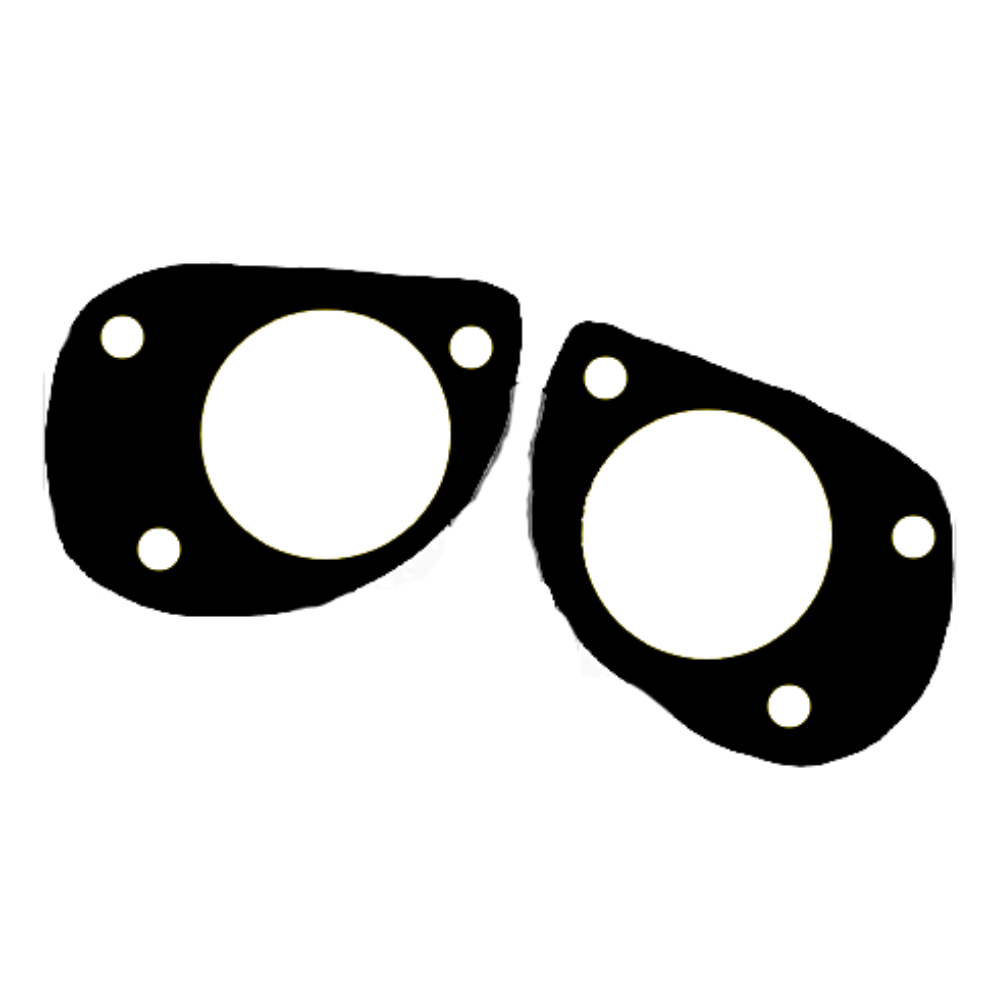

# Wall-E AI - Fullstack Notion Clone

<div align="center">
  

# Wall-E AI

_Connected workspace where better, faster work happens._

[](https://nextjs.org/)
[](https://www.typescriptlang.org/)
[](https://tailwindcss.com/)
[](https://www.convex.dev/)
[](LICENSE)

</div>

---

## 🚀 Overview

Wall-E AI is a powerful, full-stack Notion clone built with modern web technologies. It combines the familiar Notion-style interface with advanced AI capabilities, real-time collaboration, and a robust document management system. Perfect for teams and individuals looking for a flexible, AI-enhanced workspace.

## ✨ Key Features

### 📝 Core Functionality

- **Notion-style Rich Text Editor** - Powered by BlockNote for seamless document creation
- **Hierarchical Document Structure** - Organize content with infinite nested documents
- **Real-time Collaboration** - Live updates across all users with Convex
- **Document Publishing** - Share documents publicly with custom URLs
- **Trash & Recovery System** - Soft delete with full recovery capabilities

### 🤖 AI Integration

- **Multi-Provider AI Support** - Gemini and Ollama integration
- **AI-Powered Writing Assistant** - Get help with content creation and editing
- **Custom AI Settings** - Configure models, providers, and API keys
- **Smart Document Analysis** - AI-enhanced document insights and suggestions

### 🎨 User Experience

- **Dark/Light Mode** - Seamless theme switching with next-themes
- **Fully Responsive Design** - Optimized for desktop, tablet, and mobile
- **Collapsible Sidebar** - Maximize workspace with expandable navigation
- **Live Document Icons** - Dynamic icon updates across the interface
- **Cover Images** - Customize documents with beautiful cover images

### 🔧 Technical Features

- **File Management** - Upload, replace, and delete files with EdgeStore
- **Authentication** - Secure user management with Clerk
- **Type-Safe Database** - Convex for real-time, type-safe data operations
- **Modern UI Components** - Radix UI primitives with Tailwind CSS
- **Edge Computing** - Optimized performance with Vercel Edge Runtime

## 🛠️ Tech Stack

### Frontend

- **Framework:** Next.js 14 (App Router)
- **Language:** TypeScript
- **Styling:** Tailwind CSS with custom animations
- **UI Components:** Radix UI primitives
- **State Management:** Zustand
- **Icons:** Lucide React

### Backend & Database

- **Database:** Convex (Real-time, type-safe)
- **Authentication:** Clerk
- **File Storage:** EdgeStore
- **AI Integration:** Vercel AI SDK

### Editor & AI

- **Rich Text Editor:** BlockNote
- **AI Providers:** Google Gemini, Ollama
- **AI SDK:** Vercel AI SDK

## 📋 Prerequisites

- **Node.js:** Version 18.x.x or higher
- **npm:** Version 8.x.x or higher
- **Git:** For cloning the repository

## 🚀 Quick Start

### 1. Clone the Repository

```bash
git clone https://github.com/your-username/wall-e-ai.git
cd wall-e-ai
```

### 2. Install Dependencies

```bash
npm install
```

### 3. Environment Setup

Create a `.env.local` file in the root directory:

```env
# Convex
CONVEX_DEPLOYMENT=
NEXT_PUBLIC_CONVEX_URL=

# Clerk Authentication
NEXT_PUBLIC_CLERK_PUBLISHABLE_KEY=
CLERK_SECRET_KEY=

# EdgeStore (File Storage)
EDGE_STORE_ACCESS_KEY=
EDGE_STORE_SECRET_KEY=

# AI Providers (Optional - configure in app)
GOOGLE_GENERATIVE_AI_API_KEY=
OLLAMA_BASE_URL=http://localhost:11434
```

### 4. Setup Convex Database

```bash
npx convex dev
```

This will:

- Initialize your Convex project
- Set up the database schema
- Start the development server

### 5. Run the Development Server

```bash
npm run dev
```

Open [http://localhost:3000](http://localhost:3000) in your browser.

## 📁 Project Structure

```
wall-e-ai/
├── app/                          # Next.js App Router
│   ├── (main)/                   # Main application routes
│   ├── (marketing)/              # Landing page
│   ├── (public)/                 # Public routes
│   ├── api/                      # API routes
│   └── globals.css               # Global styles
├── components/                   # React components
│   ├── ui/                       # Reusable UI components
│   ├── providers/                # Context providers
│   └── modals/                   # Modal components
├── convex/                       # Database schema & functions
├── hooks/                        # Custom React hooks
├── lib/                          # Utility functions
├── public/                       # Static assets
└── types/                        # TypeScript type definitions
```

## 🔧 Configuration

### AI Settings

Wall-E AI supports multiple AI providers:

1. **Google Gemini** - Cloud-based AI with high performance
2. **Ollama** - Local AI models for privacy and offline use

Configure AI settings through the AI Settings dialog in the app or environment variables.

### Database Schema

The application uses Convex with the following main tables:

- **documents**: Core document storage with hierarchical relationships
- **users**: User management (handled by Clerk)

### File Storage

EdgeStore handles file uploads with:

- Image optimization
- Secure access control
- CDN delivery

## 📱 Usage

### Creating Documents

1. Click the "+" button in the sidebar
2. Choose "Add a Note"
3. Start writing with the rich text editor

### AI Integration

1. Open AI Settings (gear icon)
2. Configure your preferred AI provider
3. Use AI features in the editor

### Publishing Documents

1. Open a document
2. Click "Publish" in the top-right
3. Share the generated public URL

### Organizing Content

- Drag documents to create hierarchies
- Use the collapsible sidebar for navigation
- Archive documents to the trash for later recovery

## 🧪 Development

### Available Scripts

```bash
npm run dev      # Start development server
npm run build    # Build for production
npm run start    # Start production server
npm run lint     # Run ESLint
```

### Code Quality

The project uses:

- **ESLint** for code linting
- **TypeScript** for type checking
- **Prettier** for code formatting (recommended)

### Testing

```bash
npm run lint
npm run build  # Validates production build
```

## 🚀 Deployment

### Vercel (Recommended)

1. Connect your GitHub repository to Vercel
2. Add environment variables in Vercel dashboard
3. Deploy automatically on push

### Manual Deployment

```bash
npm run build
npm run start
```

## 🤝 Contributing

1. Fork the repository
2. Create a feature branch: `git checkout -b feature/amazing-feature`
3. Commit changes: `git commit -m 'Add amazing feature'`
4. Push to branch: `git push origin feature/amazing-feature`
5. Open a Pull Request

### Development Guidelines

- Follow TypeScript best practices
- Use conventional commit messages
- Ensure all tests pass
- Update documentation for new features

## 📄 License

This project is licensed under the MIT License - see the [LICENSE](LICENSE) file for details.

## 🙏 Acknowledgments

- **Antonio Erdeljac** - Original Notion clone tutorial inspiration
  - [YouTube Tutorial](https://www.youtube.com/watch?v=ZbX4Ok9YX94)
  - [GitHub](https://github.com/AntonioErdeljac)

- **BlockNote** - Excellent rich text editor framework
- **Convex** - Real-time database platform
- **Clerk** - Authentication made simple
- **Vercel** - Edge computing platform

## 📞 Support

- **Issues:** [GitHub Issues](https://github.com/your-username/wall-e-ai/issues)
- **Discussions:** [GitHub Discussions](https://github.com/your-username/wall-e-ai/discussions)
- **Documentation:** [Project Wiki](https://github.com/your-username/wall-e-ai/wiki)

---

<div align="center">

**Built with ❤️ using Next.js, TypeScript, and modern web technologies**

[🌟 Star this repo](https://github.com/your-username/wall-e-ai) • [📖 Documentation](https://github.com/your-username/wall-e-ai/wiki) • [🐛 Report Issues](https://github.com/your-username/wall-e-ai/issues)

</div>
